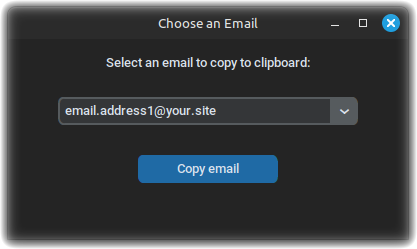

# Email Picker


* (qui trovate [la traduzione in italiano](#italian) del seguente testo)

### A lightweight Python GUI that allows you to select one of multiple predefined email addresses and automatically copy it to your clipboard.



## ✨ Features

- Clean dark-themed graphical interface
- Simple email selection via dropdown
- One-click copy to clipboard
- Auto-closes after 2 seconds
- Perfect for users who manage multiple email addresses

## 🛠️ Requirements

- Python 3.10 or newer

Python packages:

```bash
pip install -r requirements.txt
```

## 🧪 Optional: Use a Virtual Environment (recommended)

If you want to isolate the dependencies:

```bash
python3 -m venv venv
source venv/bin/activate
pip install -r requirements.txt
```
## ⚡️ Insert your own email addresses
In the `choose_email.py` file, under the comment `Example email list – you can customize these`, there are some fictitious email addresses (for example: `email.address1@your.site`). Modify these addresses and add as many as you want by putting them in quotation marks (" ")

## 🚀 Run the App

From inside the project folder:

```bash
./launch_email.sh
```

## 🖥️ Desktop Integration (Optional)

You can create a `.desktop` launcher for Linux Mint / Ubuntu and run this script like any installed app.<BR>
To do this, first create a file with a name of your choice (for example: choose_an_email.desktop`) with a `.desktop` extension wherever you want, and paste this into it (this is what I wrote, you can modify it as you wish):
```
[Desktop Entry]
Name=Choose Email
Exec=~/Scripts/choose_email.py
Icon=mail-generic
Terminal=false
Type=Application
Categories=Utility;
```
**INFO:** I've assumed that the file choose_email.py is located in /Scripts in your /home folder. Edit as you like.
Once you've saved your launcher, copy it to the folder ~/.local/share/applications/
Done!

## 📄 License

MIT – do whatever you want, just don't remove my name 😉

## ✍️ Author

Made with ❤️ by Franz Bias (Francesco)  [](https://github.com/FranzBias/email-picker/stargazers)<BR>
[https://www.bybias.com](https://www.bybias.com)

## 🤝 Contribute

Contributions are welcome!  
If you have suggestions, improvements, or bug reports, feel free to:

- Fork this repository
- Make your changes
- Open a pull request

Even feedback is appreciated. Let's improve this together!

---

### <a id="italian"></a>Traduzione in italiano (Italian translation):

# Email Picker
Una GUI Python leggera che consente di selezionare uno dei numerosi indirizzi e-mail predefiniti e copiarlo automaticamente negli appunti.


## ✨ Caratteristiche

- Interfaccia grafica pulita con tema scuro
- Semplice selezione e-mail tramite menu a discesa
- Copia negli appunti con un clic
- Chiusura automatica dopo 2 secondi
- Perfetto per gli utenti che gestiscono più indirizzi e-mail

## 🛠️ Requisiti

- Python 3.10 o più recente

Pacchetti Python:

```bash
pip install -r requirements.txt
```

## 🧪 Opzionale: utilizzare un ambiente virtuale (consigliato)

Se si desidera isolare le dipendenze:

```bash
python3 -m venv venv
source venv/bin/activate
pip install -r requirements.txt
```

## ⚡️ Per inserire i propri indirizzi e-mail
Nel file `choose_email.py`, sotto il commento `Example email list – you can customize these`, ci sono alcuni indirizzi e-mail fittizi (ad esempio: `email.address1@your.site`). Si modifichino questi indirizzi e se ne aggiungano quanti se ne desidera mettendoli tra virgolette (” ”)

## 🚀 Per eseguire l'app
Dall'interno della cartella del progetto:

bash
./launch_email.sh

## 🖥️ Integrazione desktop (opzionale)

È possibile creare un launcher `.desktop` per Linux Mint / Ubuntu ed eseguire questo script come qualsiasi app installata.<BR>
Per fare questo per prima cosa create un file con un nome a vostro piacimento (per esempio: scegli un indirizzo email.desktop) con estensione `.desktop` dove volete, e incollateci dentro questo (questo è quello che ci ho scritto io, potete modificarlo come volete):
```
[Desktop Entry]
Name=Choose Email
Exec=~/Scripts/choose_email.py
Icon=mail-generic
Terminal=false
Type=Application
Categories=Utility;
```
**INFO:** Ho dato per scontato che il file choose_email.py si trovi in /Scripts nella vostra cartella /home. Modificate a vostro piacimento.
Una volta salvato il vostro launcher, **copiatelo nella cartella** `~/.local/share/applications/`
Fatto!

## 📄 Licenza

MIT – fate quello che volete, basta che non rimuoviate il mio nome 😉

## ✍️ Autore
Realizzato con ❤️ da Franz Bias (Francesco)  [](https://github.com/FranzBias/email-picker/stargazers)<BR>
[https://www.bybias.com](https://www.bybias.com)

## 🤝 Collabora

I vostri  contributi sono benvenuti!<BR>
Se avete suggerimenti, miglioramenti o segnalazioni di bug, non esitate a:

- Forkare questo repository
- Apportare le vostre modifiche
- Aprire una pull request

Anche il feedback è apprezzato. Miglioriamolo insieme!

---
